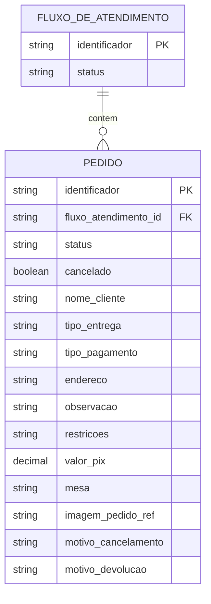

# Controle de Atendimento — Estrutura de Dados

> **Fonte:** `docs/lixo-funcional.txt` (levantamento bruto de requisitos).
> **Escopo deste documento:** entidades, atributos, tipos, enumerações, relacionamentos e regras de integridade do domínio "Controle de Atendimento".
> **Ver também:** `controle-atendimento-functional.md` (regras de negócio, máquina de estados e transições que operam sobre estes dados).
>
> Os nomes técnicos sugeridos (coluna "Nome técnico") usam `snake_case` e servem como referência para a futura geração de código (modelos, banco de dados, DTOs). Nenhum código é gerado neste documento.

## 1. Visão Geral do Modelo

O domínio possui duas entidades:

- **Fluxo de Atendimento** — agrupa os pedidos recebidos em um mesmo período de operação (ex.: um dia de funcionamento).
- **Pedido** — representa a solicitação de compra de um cliente.

**Cardinalidade:** 1 Fluxo de Atendimento → N Pedidos. Todo Pedido pertence a exatamente um Fluxo de Atendimento.

## 2. Entidade: Fluxo de Atendimento

| Atributo (negócio) | Nome técnico | Tipo | Tamanho/Domínio | Obrigatório | Default | Observações |
|---|---|---|---|---|---|---|
| Identificador | `identificador` | Texto | 15 caracteres | Sim | Data corrente | Chave de negócio. Editável pelo usuário a qualquer momento enquanto o fluxo estiver `aberto` (confirmado, ver `controle-atendimento-functional.md` **FN-3**). Formato exato da data não definido na origem — ver **DS-1**. |
| Status | `status` | Enumeração | `aberto`, `fechado` (§4.1) | Sim | `aberto` | Transições descritas em `controle-atendimento-functional.md` §5. |

**Regra de unicidade:** deve existir no máximo um registro com `status = aberto` em todo o sistema (validação de aplicação, não é uma restrição de coluna).

## 3. Entidade: Pedido

| Atributo (negócio) | Nome técnico | Tipo | Tamanho/Domínio | Obrigatório | Default | Grupo funcional | Observações |
|---|---|---|---|---|---|---|---|
| Identificador | `identificador` | Texto | 20 caracteres | Sim, sempre | — | Cadastro | Único dado exigido para criar um Pedido em `aguardando_atendimento`. |
| Fluxo de Atendimento (FK) | `fluxo_atendimento_id` | Referência → Fluxo de Atendimento | — | Sim | Fluxo aberto no momento da criação | Cadastro | Relação não citada explicitamente na origem; inferida da cardinalidade 1:N — ver **DS-2**. |
| Status | `status` | Enumeração | ver §4.2 | Sim | `aguardando_atendimento` | Cadastro | Máquina de estados completa em `controle-atendimento-functional.md` §6. |
| Cancelamento | `cancelado` | Booleano | `true`/`false` | Sim | `false` | Cancelamento | Flag independente de `status`: cancelar **não** é um valor da enumeração de status, apenas marca o pedido — ver **DS-3**. |
| Nome Cliente | `nome_cliente` | Texto | 50 caracteres | Condicional | — | Cadastro | Exigido para o pedido atingir `em_atendimento` (ver §6 do functional). |
| Tipo Entrega | `tipo_entrega` | Enumeração | `delivery`, `retirada_balcao` (§4.3) | Condicional | — | Cadastro | Exigido para `em_atendimento`. Determina regras condicionais de endereço e as transições finais do pedido. |
| Tipo de Pagamento | `tipo_pagamento` | Enumeração | `pix`, `cartao`, `dinheiro` (§4.4) | Condicional | — | Cadastro | Exigido para `em_atendimento`. |
| Endereço | `endereco` | Texto | 500 caracteres | Condicional | — | Cadastro | Interpretado como obrigatório apenas quando `tipo_entrega = delivery` — inferência, ver **DS-4**. |
| Observação | `observacao` | Texto | 100 caracteres | Não | — | Cadastro | Tratada como nota livre opcional — inferência, ver **DS-5**. |
| Restrições | `restricoes` | Texto | 500 caracteres | Não | — | Execução | Informada na etapa "Executar Pedido"; a origem marca explicitamente como opcional. |
| Valor Pix | `valor_pix` | Numérico monetário | — | Não | — | Execução | Informado na etapa "Executar Pedido"; explicitamente opcional. Presente independentemente do `tipo_pagamento` — ver **DS-6**. |
| Mesa | `mesa` | Texto | 20 caracteres | Sim, ao executar | — | Execução | Obrigatória na transição `em_atendimento → em_execucao`. Também usada como filtro de busca. |
| Imagem do Pedido | `imagem_pedido_ref` | Referência a imagem | — | Sim, ao executar | — | Execução | Obrigatória na transição `em_atendimento → em_execucao` (não marcada como opcional na origem). Formato de armazenamento/upload não definido — ver **DS-7**. |
| Motivo Cancelamento | `motivo_cancelamento` | Texto | 100 caracteres | Não | — | Cancelamento | Preenchido apenas quando `cancelado = true`. |
| Motivo Devolução | `motivo_devolucao` | Texto | 100 caracteres | Sim, ao devolver | — | Devolução | Obrigatório na transição `enviado → devolvido`. UI sugere "Não encontrado" e "Devolvido pelo cliente", mas aceita texto livre. |

## 4. Enumerações

### 4.1 Status do Fluxo de Atendimento

| Valor | Descrição |
|---|---|
| `aberto` | Fluxo em operação; aceita criação/alteração de pedidos. |
| `fechado` | Fluxo encerrado; pedidos somente leitura. |

### 4.2 Status do Pedido

| Valor | Descrição |
|---|---|
| `aguardando_atendimento` | Pedido criado apenas com identificador. |
| `em_atendimento` | Dados de cadastro completos. |
| `em_execucao` | Dados de execução (mesa + imagem) informados. |
| `retirado_no_balcao` | Entrega concluída — retirada no balcão. |
| `enviado` | Pedido saiu para entrega (delivery). |
| `entregue` | Entrega concluída — delivery. |
| `devolvido` | Pedido retornado, não entregue ao cliente (delivery). Valor confirmado pelo negócio — ver **DS-8**. |

### 4.3 Tipo de Entrega

| Valor | Descrição |
|---|---|
| `delivery` | Entrega no endereço do cliente. |
| `retirada_balcao` | Cliente retira o pedido no balcão. |

### 4.4 Tipo de Pagamento

| Valor | Descrição |
|---|---|
| `pix` | Pagamento via Pix. |
| `cartao` | Pagamento via cartão. |
| `dinheiro` | Pagamento em dinheiro. |

## 5. Relacionamentos e Integridade

- Um Fluxo de Atendimento possui 0..N Pedidos.
- Um Pedido pertence a exatamente 1 Fluxo de Atendimento, definido no momento da criação e imutável depois (não há relato de mover um pedido entre fluxos).
- No máximo um Fluxo de Atendimento pode estar com `status = aberto` simultaneamente.
- Todo Pedido vinculado a um Fluxo de Atendimento com `status = fechado` é somente leitura (nenhum atributo pode ser alterado, incluindo `status` e `cancelado`).

## 6. Pendências / Assunções a validar com o negócio

| ID | Descrição | Interpretação adotada neste documento |
|---|---|---|
| DS-1 | Formato exato da data usada como `identificador` padrão do Fluxo de Atendimento (15 caracteres é maior que `dd/mm/aaaa`). | Não assumido; definir formato antes da implementação. |
| DS-2 | A origem não menciona explicitamente uma chave estrangeira do Pedido para o Fluxo de Atendimento. | Assumida como obrigatória, pois a funcionalidade "Novo Pedido" só existe dentro de um fluxo aberto. |
| DS-3 | `cancelado` é tratado como atributo independente de `status`, não como um valor de status. | Mantido assim por ser a leitura mais literal da origem (atributo "Cancelamento" separado do atributo "Status"). |
| DS-4 | Obrigatoriedade do `endereco` somente quando `tipo_entrega = delivery`. | Inferência lógica; a origem não afirma isso explicitamente. |
| DS-5 | Obrigatoriedade de `observacao` para a transição a `em_atendimento`. | Tratada como opcional; a origem não a cita entre os dados de execução nem a marca como obrigatória. |
| DS-6 | `valor_pix` é coletado na etapa de execução do pedido, e não no cadastro, mesmo quando o pagamento não é Pix. | Mantido conforme literalidade da origem; validar se deve ser condicionado a `tipo_pagamento = pix`. |
| DS-7 | Formato de armazenamento/upload da "Imagem do Pedido" (arquivo, URL, tabela auxiliar). | Não definido na origem; tratado como referência genérica a um recurso de imagem. |
| DS-8 *(confirmado)* | O enum de Status do Pedido lista `devolvido`, mas a funcionalidade 3.9 (na origem) descreve o destino como "não entregue". | **Confirmado pelo negócio:** não existe status "não entregue". O valor correto e definitivo é `devolvido`; ver também **FN-1** em `controle-atendimento-functional.md`. |
