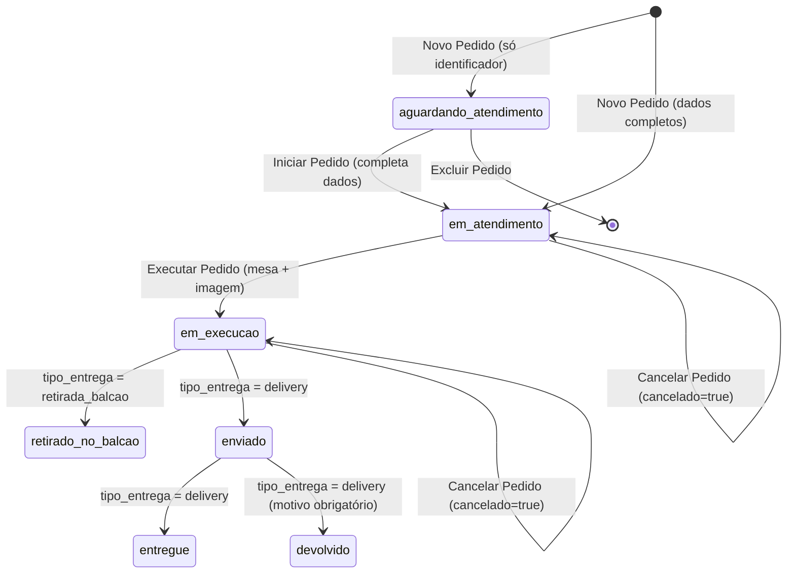

# Controle de Atendimento — Especificação Funcional

> **Fonte:** `docs/lixo-funcional.txt` (levantamento bruto de requisitos, reestruturado abaixo).
> **Escopo deste documento:** visão geral, conceitos de domínio, regras de negócio e máquina de estados do fluxo de atendimento de pedidos.
> **Ver também:** `controle-atendimento-data-structure.md` (atributos, tipos e enumerações citados aqui).

## 1. Visão Geral

O objetivo do sistema é controlar o fluxo de atendimento de pedidos de um estabelecimento. O processo de negócio se inicia sempre que um cliente entra em contato — por ligação telefônica ou WhatsApp — para solicitar uma compra. O usuário do sistema (atendente) registra essa solicitação como um **Pedido**, dentro de um **Fluxo de Atendimento** ativo.

## 2. Atores

- **Atendente / Usuário do sistema**: único ator identificado na origem. Responsável por abrir/fechar fluxos de atendimento e por criar, atualizar e transicionar pedidos.

## 3. Conceitos de Domínio

- **Fluxo de Atendimento**: agrupa um ou mais pedidos recebidos em um mesmo período de operação. Possui status `aberto` ou `fechado`. Detalhes de atributos em `controle-atendimento-data-structure.md` §2.
- **Pedido**: representa a solicitação de compra de um cliente, associada a um Fluxo de Atendimento. Possui um ciclo de vida com múltiplos estados (§6). Detalhes de atributos em `controle-atendimento-data-structure.md` §3.

## 4. Regras de Negócio Gerais

1. Deve existir no máximo **um** Fluxo de Atendimento com `status = aberto` em todo o sistema.
2. Um Fluxo de Atendimento com `status = fechado` é **somente leitura**: nenhum de seus pedidos pode ser criado, alterado ou excluído — apenas visualizado.
3. Toda operação de escrita sobre um Pedido (criar, iniciar, executar, cancelar, avançar estado, excluir) exige que o Fluxo de Atendimento ao qual ele pertence esteja `aberto`.

## 5. Fluxo de Atendimento — Comportamento

### 5.1 Inicialização do Sistema

- Ao iniciar, o sistema verifica se existe um Fluxo de Atendimento com `status = aberto`.
  - **Se existir:** apresenta esse fluxo ao usuário.
  - **Se não existir:** apresenta o histórico de fluxos de atendimento e permite a criação de um novo.

### 5.2 Criar Novo Fluxo de Atendimento

- Pré-condição: nenhum fluxo com `status = aberto` no momento da criação (regra geral 1).
- O sistema sugere a data corrente como `identificador` (ver pendência **DS-1** no documento de dados quanto ao formato).
- O usuário pode alterar o `identificador` sugerido para qualquer outro valor de texto.
- Estado inicial do novo fluxo: `aberto`.

### 5.3 Finalizar Fluxo de Atendimento

- Um Fluxo de Atendimento `aberto` pode ser fechado pelo usuário a qualquer momento (não há pré-condição sobre o estado dos pedidos nele contidos).
- Ao ser fechado (`status = fechado`), os pedidos associados tornam-se imutáveis (regra geral 2).

### 5.4 Consultar Histórico de Fluxos de Atendimento

- O usuário pode sair do fluxo de atendimento corrente e abrir (visualizar) um fluxo de atendimento anterior, independentemente do status dele.
- Fluxos fechados são abertos apenas em modo leitura (regra geral 2).

### 5.5 Buscar Pedidos em um Fluxo de Atendimento

- Dentro de um fluxo de atendimento selecionado, o usuário pode buscar pedidos pelos seguintes critérios:
  - Nome do cliente (`nome_cliente`)
  - Identificador do pedido (ver **FN-2**)
  - Número da mesa (`mesa`)
  - Endereço de entrega (`endereco`)

## 6. Pedido — Máquina de Estados

### 6.1 Diagrama de Estados

> Nota: "Cancelar Pedido" não é uma transição de `status` — é a marcação do atributo independente `cancelado = true` (ver `controle-atendimento-data-structure.md`, pendência **DS-3**). O diagrama representa isso como um self-loop para deixar explícito que o `status` corrente é preservado.

### 6.2 Tabela de Transições

| Origem (doc.) | Funcionalidade | Estado atual | Ação | Pré-condições | Dados exigidos na ação | Estado resultante |
|---|---|---|---|---|---|---|
| 3.1 | Novo Pedido | *(inexistente)* | Criar pedido informando apenas o identificador | Fluxo de Atendimento aberto | `identificador` | `aguardando_atendimento` |
| 3.1 | Novo Pedido | *(inexistente)* | Criar pedido informando todos os dados de cadastro | Fluxo de Atendimento aberto | `identificador` + dados de cadastro completos (§7) | `em_atendimento` |
| 3.2 | Iniciar Pedido | `aguardando_atendimento` | Abrir tela de cadastro, completar dados e salvar | Fluxo de Atendimento aberto | dados de cadastro completos (§7) | `em_atendimento` |
| 3.3 | Excluir Pedido | `aguardando_atendimento` | Excluir pedido | Fluxo de Atendimento aberto | — | registro removido |
| 3.4 | Executar Pedido | `em_atendimento` | Informar dados de execução e salvar | Fluxo de Atendimento aberto | `mesa` (obrigatório), `imagem_pedido_ref` (obrigatório), `valor_pix` (opcional), `restricoes` (opcional) | `em_execucao` |
| 3.5 | Cancelar Pedido | `em_atendimento` ou `em_execucao` | Cancelar pedido | Fluxo de Atendimento aberto | `motivo_cancelamento` (opcional) | mesmo `status`; `cancelado = true` |
| 3.6 | Pedido Retirado no Balcão | `em_execucao` | Marcar retirada no balcão | `tipo_entrega = retirada_balcao` | — | `retirado_no_balcao` |
| 3.7 | Pedido Enviado | `em_execucao` | Marcar envio | `tipo_entrega = delivery` | — | `enviado` |
| 3.8 | Pedido Entregue | `enviado` | Marcar entrega | `tipo_entrega = delivery` | — | `entregue` |
| 3.9 | Pedido Devolvido | `enviado` | Marcar devolução | `tipo_entrega = delivery` | `motivo_devolucao` (obrigatório) | `devolvido` (ver **FN-1**) |

## 7. Critério de "Cadastro Completo" (transição para `em_atendimento`)

A origem define a transição para `em_atendimento` como "todos os dados preenchidos", sem enumerar exatamente quais. Interpretação adotada — campos do **grupo Cadastro** (ver `controle-atendimento-data-structure.md` §3):

- `nome_cliente` — obrigatório
- `tipo_entrega` — obrigatório
- `tipo_pagamento` — obrigatório
- `endereco` — obrigatório **somente se** `tipo_entrega = delivery` (ver **DS-4**)
- `observacao` — opcional (ver **DS-5**)

Campos do grupo **Execução** (`mesa`, `imagem_pedido_ref`, `valor_pix`, `restricoes`) e do grupo **Cancelamento/Devolução** (`motivo_cancelamento`, `motivo_devolucao`) **não** fazem parte deste critério — eles são exigidos em transições posteriores específicas (§6.2).

## 8. Regras de Validação Funcional (resumo)

- Um Pedido só pode ser criado/alterado se o Fluxo de Atendimento associado estiver `aberto` (regra geral 3).
- `endereco` é relevante apenas quando `tipo_entrega = delivery` (**DS-4**).
- As transições `retirado_no_balcao`, `enviado`, `entregue` e `devolvido` são condicionadas ao valor de `tipo_entrega` (balcão vs. delivery), conforme tabela §6.2.
- `motivo_devolucao` é obrigatório apenas na transição `enviado → devolvido`; a interface pode sugerir os valores "Não encontrado" e "Devolvido pelo cliente", mas deve aceitar texto livre.
- `motivo_cancelamento` é sempre opcional.

## 9. Pendências / Assunções a validar com o negócio

| ID | Descrição | Interpretação adotada neste documento |
|---|---|---|
| FN-1 | A funcionalidade 3.9 da origem descreve o destino do pedido como "não entregue", mas o atributo `status` do Pedido enumera o valor `devolvido` (sem "não entregue" na lista). | Adotado `devolvido` como valor canônico de status, por estar formalmente listado na enumeração de atributos (ver **DS-8**). |
| FN-2 | A busca de pedidos (§5.5, item 2.4 da origem) cita "identificador do cliente", mas não existe atributo com esse nome no Pedido — apenas `identificador` (do pedido) e `nome_cliente`. | Interpretado como busca pelo `identificador` do Pedido. |
| FN-3 | Não fica claro se o `identificador` do Fluxo de Atendimento pode ser alterado após a criação, ou somente no momento de criação. | Assumido como editável apenas na criação; revisar se deve ser editável a qualquer momento enquanto `aberto`. |
| FN-4 | Não há relato sobre se `mesa`, `valor_pix`, `restricoes` e `imagem_pedido_ref` podem ser alterados após o pedido entrar em `em_execucao`. | Não assumido; definir política de edição pós-execução antes da implementação. |
| FN-5 | Não há relato do comportamento esperado ao tentar abrir um novo Fluxo de Atendimento enquanto já existe um `aberto` (bloqueio silencioso, mensagem de erro, fechamento automático do anterior). | Assumido como bloqueio com mensagem ao usuário (consistente com a regra geral 1). |
| FN-6 | Não fica claro se "Excluir Pedido" (3.3) é exclusão definitiva (hard delete) ou lógica (soft delete, mantendo histórico). | Não assumido; definir antes da implementação, especialmente por impacto em auditoria/histórico do fluxo. |
| FN-7 | Não há relato sobre se um Pedido com `cancelado = true` continua aparecendo nas buscas (§5.5) e nas listagens do fluxo, nem se pode ser "descancelado". | Assumido que permanece visível (para histórico) e que não há reversão do cancelamento; revisar com o negócio. |
| FN-8 | Não há relato sobre retrocesso de estado (ex.: corrigir um pedido marcado como `enviado` por engano, voltando para `em_execucao`). | Não assumido; a máquina de estados (§6) é tratada como estritamente progressiva, salvo indicação em contrário. |

## 10. Fora de Escopo deste Documento

- Requisitos não funcionais (performance, segurança, disponibilidade): ver `controle-atendimento-non-functional.md` (pendente de elaboração).
- Layout de telas e protótipo de interface: ver `controle-atendimento-prototype.md` (pendente de elaboração).
