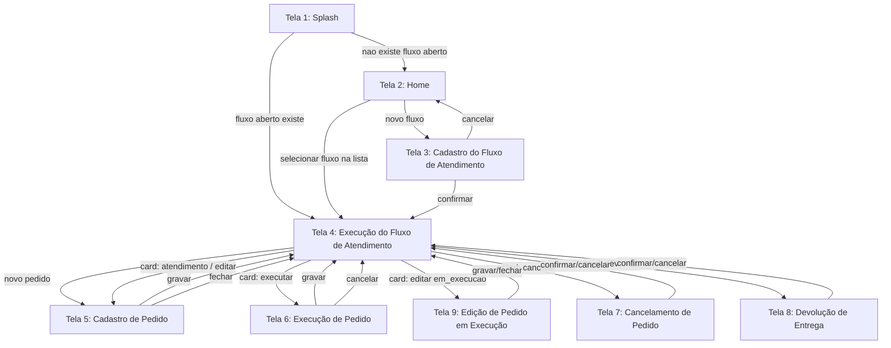

# Controle de Atendimento — Especificação de Protótipo (UI/UX)

> **Fonte:** `docs/lixo-prototipo.txt` (levantamento bruto de telas, reestruturado abaixo).
> **Escopo deste documento:** telas, navegação, elementos visuais, campos e operações da interface do app mobile.
> **Ver também:** `controle-atendimento-functional.md` (regras de negócio e máquina de estados que a UI aciona), `controle-atendimento-data-structure.md` (nomes técnicos e tipos dos campos exibidos) e `controle-atendimento-non-functional.md` (plataforma Android/Flutter, offline, sem autenticação).

## 1. Visão Geral

O app possui **9 telas numeradas**. Diálogos de confirmação simples e nativos (ex.: "confirmar exclusão do pedido?") não são contados como telas numeradas — são modais leves acionados a partir de uma tela.

| Tela | Nome | Tipo |
|---|---|---|
| 1 | Splash | Tela de carregamento/roteamento |
| 2 | Home | Listagem de Fluxos de Atendimento |
| 3 | Cadastro do Fluxo de Atendimento | Formulário |
| 4 | Execução do Fluxo de Atendimento | Quadro Kanban (visualização principal) |
| 5 | Cadastro de Pedido | Formulário |
| 6 | Execução de Pedido | Formulário |
| 7 | Cancelamento de Pedido | Diálogo/formulário |
| 8 | Devolução de Entrega | Diálogo/formulário |
| 9 | Edição de Pedido em Execução | Formulário |

## 2. Mapa de Navegação

> Nota: a rota de saída da Splash quando existe um Fluxo de Atendimento `aberto` é a **Tela 4** (Execução do Fluxo de Atendimento) — confirmado, ver **P-1**.

## 3. Especificação das Telas

### 3.1 Tela 1 — Splash

- Exibe indicação de carregamento enquanto o sistema verifica, no SQLite local, se existe um `fluxo_atendimento` com `status = aberto` (`controle-atendimento-data-structure.md` §2).
- Roteamento pós-verificação:
  - **Existe fluxo aberto:** navega para a **Tela 4**, carregando esse fluxo.
  - **Não existe fluxo aberto:** navega para a **Tela 2**.

### 3.2 Tela 2 — Home

- Lista todos os Fluxos de Atendimento (`aberto` e `fechado`), ordenados por `identificador`/data decrescente.
- Botão **"Novo Fluxo"**.

| Ação | Operação |
|---|---|
| Clique em "Novo Fluxo" | Abre a **Tela 3**. |
| Clique em um fluxo da lista | Abre a **Tela 4** com o fluxo selecionado. Se `status = fechado`, a Tela 4 abre em modo somente leitura (`controle-atendimento-functional.md`, regra geral 2). |

### 3.3 Tela 3 — Cadastro do Fluxo de Atendimento

Campos:

| Campo (UI) | Nome técnico | Origem | Observações |
|---|---|---|---|
| Identificador | `identificador` | `data-structure.md` §2 | Pré-preenchido com a data corrente (sugestão); editável pelo usuário (`functional.md` §5.2). |

Footer: botões **Confirmar** e **Cancelar**.

| Ação | Operação |
|---|---|
| Confirmar | Cria o Fluxo de Atendimento (`status = aberto`) e abre a **Tela 4** (`functional.md` §5.2). Se já existir um fluxo `aberto`, a criação é bloqueada e uma mensagem de erro é exibida (`functional.md` **FN-5**). |
| Cancelar | Descarta o formulário e retorna à **Tela 2**. |

### 3.4 Tela 4 — Execução do Fluxo de Atendimento

**Header:**

- Identificador do Fluxo de Atendimento (`fluxo_atendimento.identificador`).
- Botão **"Novo Pedido"** (rotulado "novo atendimento" na origem).
- Botão **"Busca de Pedidos"** — funcionalidade descrita em `functional.md` §5.5, mas **não implementada nesta fase do protótipo** (ver **P-7**).

**Visualizador (quadro Kanban com rolagem horizontal):**

Uma coluna por valor de `status` do Pedido (`data-structure.md` §4.2), nesta ordem:

`aguardando_atendimento` → `em_atendimento` → `em_execucao` → `retirado_no_balcao` → `enviado` → `entregue` → `devolvido`

- Não existe coluna para pedidos cancelados. `cancelado = true` é representado dentro do próprio card, na coluna correspondente ao `status` atual do pedido (ver §4, regra transversal de cancelamento).
- Se o Fluxo de Atendimento estiver `fechado`, o quadro é somente leitura: nenhum botão de ação é exibido em nenhum card (`functional.md`, regra geral 2).

| Ação | Operação |
|---|---|
| Clique em "Novo Pedido" | Abre a **Tela 5** sem pedido pré-selecionado (fluxo "Novo Pedido", `functional.md` §6.2, 3.1). |
| Clique em "Busca de Pedidos" | Não implementado nesta fase (**P-7**). |

### 3.5 Tela 5 — Cadastro de Pedido

Campos:

| Campo (UI) | Nome técnico | Origem | Observações |
|---|---|---|---|
| Identificador do Pedido | `identificador` | `data-structure.md` §3 | Único campo habilitado inicialmente (ver regra de gravação abaixo). |
| Nome do Cliente | `nome_cliente` | `data-structure.md` §3 | — |
| Tipo de Entrega | `tipo_entrega` | `data-structure.md` §4.3 | `delivery` / `retirada_balcao`. |
| Tipo de Pagamento | `tipo_pagamento` | `data-structure.md` §4.4 | `pix` / `cartao` / `dinheiro`. |
| Endereço | `endereco` | `data-structure.md` §3 | Obrigatório somente se `tipo_entrega = delivery` (`functional.md` **DS-4**). |
| Observação | `observacao` | `data-structure.md` §3 | Opcional. |

Footer: botões **Gravar** e **Fechar**.

**Regra de habilitação e gravação:**

1. Todos os campos, exceto Identificador, iniciam desabilitados.
2. O usuário informa o Identificador (do Pedido) e confirma:
   - **Se já existir um Pedido com esse `identificador` no Fluxo de Atendimento atual** (criado anteriormente só com identificador, em `aguardando_atendimento`): os demais campos são habilitados e pré-preenchidos com os dados já salvos desse pedido — a tela passa a operar como "Iniciar Pedido" (`functional.md` §6.2, 3.2).
   - **Se não existir:** os demais campos são habilitados em branco — a tela opera como "Novo Pedido" (`functional.md` §6.2, 3.1).
   - Confirmado pelo negócio, ver **P-4**.
3. Clique em **Gravar**:
   - Se todos os campos do grupo Cadastro estiverem preenchidos conforme critério de "cadastro completo" (`functional.md` §7): grava com `status = em_atendimento`.
   - Se apenas o identificador estiver preenchido: grava com `status = aguardando_atendimento`.
   - `endereco` é exigido apenas quando `tipo_entrega = delivery`.
4. Clique em **Fechar**: descarta as alterações não gravadas e retorna à **Tela 4**, sem abrir a Tela 7 (**P-5**, confirmado — botão renomeado de "Cancelar" para "Fechar").

### 3.6 Tela 6 — Execução de Pedido

Campos:

| Campo (UI) | Nome técnico | Origem | Observações |
|---|---|---|---|
| Imagem (capturada pela câmera) | `imagem_pedido_ref` | `data-structure.md` §3 | Obrigatória (`functional.md` §6.2, 3.4). Armazenada como caminho de arquivo local (`controle-atendimento-non-functional.md` §5). |
| Mesa | `mesa` | `data-structure.md` §3 | Obrigatória (`functional.md` §6.2, 3.4). |
| Restrições | `restricoes` | `data-structure.md` §3 | Opcional. |
| Valor Pagamento | `valor_pagamento` | `data-structure.md` §3 | Opcional; não vinculado a `tipo_pagamento` (`data-structure.md` **DS-6**). |

Footer: botões **Gravar** e **Cancelar**.

| Ação | Operação |
|---|---|
| Gravar | Salva os campos de Execução e muda `status` para `em_execucao` (`functional.md` §6.2, 3.4). |
| Cancelar | Fecha a tela sem gravar, retorna à **Tela 4**. |

> Esta tela é usada apenas na transição `em_atendimento → em_execucao` (3.4). Para editar os dados de um pedido que já está em `em_execucao`, ver **Tela 9** (§3.9) — **P-6**, confirmado.

### 3.7 Tela 7 — Cancelamento de Pedido

Campos:

| Campo (UI) | Nome técnico | Origem | Observações |
|---|---|---|---|
| Motivo | `motivo_cancelamento` | `data-structure.md` §3 | Opcional (`functional.md` §8). |

Footer: botões **Confirmar** e **Cancelar**.

| Ação | Operação |
|---|---|
| Confirmar | Define `cancelado = true`, mantendo o `status` corrente do pedido (`functional.md` §6.1, nota do diagrama). Fecha a tela, retorna à **Tela 4**. |
| Cancelar | Fecha a tela sem alterar o pedido, retorna à **Tela 4**. |

### 3.8 Tela 8 — Devolução de Entrega

Campos:

| Campo (UI) | Nome técnico | Origem | Observações |
|---|---|---|---|
| Motivo da Devolução | `motivo_devolucao` | `data-structure.md` §3 | Obrigatório; default sugerido "Não encontrado", aceita texto livre (`data-structure.md` §3, `functional.md` §8). |

Footer: botões **Confirmar** e **Cancelar**.

| Ação | Operação |
|---|---|
| Confirmar | Muda `status` para `devolvido` (`functional.md` §6.2, 3.9). Fecha a tela, retorna à **Tela 4**. |
| Cancelar | Fecha a tela sem alterar o pedido, retorna à **Tela 4**. |

### 3.9 Tela 9 — Edição de Pedido em Execução

Acionada pelo botão **Editar** do card `em_execucao` (§4.3) — **P-6**, confirmado. Permite alterar **todos os campos editáveis do Pedido**, tanto do grupo Cadastro quanto do grupo Execução, não apenas os campos da transição `em_atendimento → em_execucao` (Tela 6).

Campos:

| Campo (UI) | Nome técnico | Origem | Observações |
|---|---|---|---|
| Identificador do Pedido | `identificador` | `data-structure.md` §3 | Somente leitura (chave do Pedido, não editável). |
| Nome do Cliente | `nome_cliente` | `data-structure.md` §3 | Grupo Cadastro. |
| Tipo de Entrega | `tipo_entrega` | `data-structure.md` §4.3 | Grupo Cadastro. `delivery` / `retirada_balcao`. |
| Tipo de Pagamento | `tipo_pagamento` | `data-structure.md` §4.4 | Grupo Cadastro. `pix` / `cartao` / `dinheiro`. |
| Endereço | `endereco` | `data-structure.md` §3 | Grupo Cadastro. Exibido/obrigatório somente se `tipo_entrega = delivery` (**DS-4**). |
| Observação | `observacao` | `data-structure.md` §3 | Grupo Cadastro. Opcional. |
| Mesa | `mesa` | `data-structure.md` §3 | Grupo Execução. |
| Restrições | `restricoes` | `data-structure.md` §3 | Grupo Execução. Opcional. |
| Valor Pagamento | `valor_pagamento` | `data-structure.md` §3 | Grupo Execução. Opcional. |
| Imagem do Pedido | `imagem_pedido_ref` | `data-structure.md` §3 | Grupo Execução. Nova captura pela câmera substitui a imagem atual. |

Footer: botões **Gravar** e **Fechar**.

| Ação | Operação |
|---|---|
| Gravar | Salva as alterações em todos os campos acima. O `status` permanece `em_execucao` (`functional.md` **FN-4**) — esta tela não realiza nenhuma transição de estado. |
| Fechar | Descarta as alterações não gravadas e retorna à **Tela 4**. |

## 4. Cards de Pedido (colunas do Quadro Kanban da Tela 4)

Regras transversais a todos os cards (ver também §5):

- Se `cancelado = true`: exibir o rótulo "cancelado" em vermelho no card.
- O footer de ações do card só é exibido se `cancelado = false`. Um pedido cancelado permanece visível na coluna do seu `status` atual, sem ações disponíveis (`functional.md` **FN-7**).
- `endereco` só é exibido quando `tipo_entrega = delivery`.

### 4.1 Coluna `aguardando_atendimento`

| Elemento | Campo técnico |
|---|---|
| Identificador do Pedido | `identificador` |

Footer: botões **Atendimento** e **Excluir**.

| Ação | Operação |
|---|---|
| Atendimento | Abre a **Tela 5** com este pedido (fluxo "Iniciar Pedido", `functional.md` §6.2, 3.2). |
| Excluir | Abre diálogo de confirmação nativo; em caso de confirmação, exclui definitivamente (hard delete, `functional.md` **FN-6**) e atualiza o quadro. |

### 4.2 Coluna `em_atendimento`

| Elemento | Campo técnico |
|---|---|
| Identificador do Pedido | `identificador` |
| Nome do Cliente | `nome_cliente` |
| Tipo de Entrega | `tipo_entrega` |
| Tipo de Pagamento | `tipo_pagamento` |
| Endereço (condicional) | `endereco` |
| Observação | `observacao` |
| Indicador de cancelamento | `cancelado` |

Footer (somente se `cancelado = false`): botões **Executar**, **Editar** e **Cancelar** (confirmado, ver **P-2**).

| Ação | Operação |
|---|---|
| Executar | Abre a **Tela 6**. |
| Editar | Abre a **Tela 5** com este pedido (edição dos dados de Cadastro). |
| Cancelar | Abre a **Tela 7**. |

### 4.3 Coluna `em_execucao`

| Elemento | Campo técnico |
|---|---|
| Identificador do Pedido | `identificador` |
| Nome do Cliente | `nome_cliente` |
| Tipo de Entrega | `tipo_entrega` |
| Tipo de Pagamento | `tipo_pagamento` |
| Endereço (condicional) | `endereco` |
| Observação | `observacao` |
| Mesa | `mesa` |
| Restrições | `restricoes` |
| Imagem do Pedido | `imagem_pedido_ref` |
| Indicador de cancelamento | `cancelado` |

Footer (somente se `cancelado = false`): um botão de tipo de entrega + botões **Editar** e **Cancelar**.

- Se `tipo_entrega = delivery`: botão **Enviado**.
- Se `tipo_entrega = retirada_balcao`: botão **Retirado**.

| Ação | Operação |
|---|---|
| Retirado | Muda `status` para `retirado_no_balcao`; atualiza o quadro. |
| Enviado | Muda `status` para `enviado`; atualiza o quadro. |
| Editar | Abre a **Tela 9**, permitindo alterar todos os campos do pedido (Cadastro + Execução) sem mudar o `status` (**P-6**, confirmado). |
| Cancelar | Abre a **Tela 7**. |

### 4.4 Coluna `retirado_no_balcao`

| Elemento | Campo técnico |
|---|---|
| Identificador do Pedido | `identificador` |
| Nome do Cliente | `nome_cliente` |
| Tipo de Entrega | `tipo_entrega` |
| Tipo de Pagamento | `tipo_pagamento` |
| Observação | `observacao` |
| Mesa | `mesa` |
| Restrições | `restricoes` |
| Imagem do Pedido | `imagem_pedido_ref` |

Sem footer — estado terminal, sem transições de saída (`functional.md` §6.1).

### 4.5 Coluna `enviado`

| Elemento | Campo técnico |
|---|---|
| Identificador do Pedido | `identificador` |
| Nome do Cliente | `nome_cliente` |
| Tipo de Entrega | `tipo_entrega` |
| Tipo de Pagamento | `tipo_pagamento` |
| Endereço (condicional) | `endereco` |
| Observação | `observacao` |
| Mesa | `mesa` |
| Restrições | `restricoes` |
| Imagem do Pedido | `imagem_pedido_ref` |

Footer: botões **Entregue** e **Devolvido**.

| Ação | Operação |
|---|---|
| Entregue | Muda `status` para `entregue`; atualiza o quadro. |
| Devolvido | Abre a **Tela 8**. |

### 4.6 Coluna `entregue`

Confirmado pelo negócio (ver **P-3**): mesmos elementos do card `enviado` (identificador, nome_cliente, tipo_entrega, tipo_pagamento, endereco condicional, observacao, mesa, restricoes, imagem_pedido_ref), sem footer — estado terminal.

### 4.7 Coluna `devolvido`

Confirmado pelo negócio (ver **P-3**): mesmos elementos do card `enviado`, acrescido do Motivo da Devolução (`motivo_devolucao`), sem footer — estado terminal.

## 5. Regras de UI Transversais

- **Cancelamento:** `cancelado = true` exibe o rótulo "cancelado" em vermelho e oculta o footer de ações do card, em qualquer coluna onde o pedido apareça (§4).
- **Endereço condicional:** exibido apenas quando `tipo_entrega = delivery`, em qualquer tela/card que apresente esse campo (`data-structure.md` **DS-4**).
- **Somente leitura:** com o Fluxo de Atendimento `fechado`, a Tela 4 e todos os cards são renderizados sem nenhum botão de ação (`functional.md`, regra geral 2).
- **Diálogos de confirmação simples** (ex.: exclusão de pedido) são modais nativos e não constituem uma das 8 telas numeradas.

## 6. Pendências / Assunções a validar com o negócio

| ID | Descrição | Interpretação adotada neste documento |
|---|---|---|
| P-1 *(confirmado)* | A origem indica que, ao existir um fluxo `aberto`, a Splash navega para a "tela 3" — mas a Tela 3 é o Cadastro do Fluxo de Atendimento, não a visualização de um fluxo existente. | **Confirmado pelo negócio:** erro de numeração na origem; a Splash navega para a **Tela 4** (Execução do Fluxo de Atendimento). |
| P-2 *(confirmado)* | O card `em_atendimento` descreve footer com "botão para executar e botão para cancelar" (2 botões), mas lista também a operação "clique botão editar" (3ª ação). | **Confirmado pelo negócio:** existe o botão Editar; footer com 3 botões (Executar, Editar, Cancelar). |
| P-3 *(confirmado)* | A origem não define os cards das colunas `entregue` e `devolvido`. | **Confirmado pelo negócio:** segue a interpretação adotada — reaproveitar os elementos do card `enviado` (sem footer, estado terminal); o card `devolvido` acrescenta `motivo_devolucao`. |
| P-4 *(confirmado)* | Não está claro o que significa "se o identificador existir" na regra de gravação da Tela 5 (Cadastro de Pedido), nem o que exatamente é recuperado. | **Confirmado pelo negócio:** é o identificador de um Pedido. Segue a interpretação adotada — busca por um Pedido já existente no Fluxo de Atendimento atual; se existir, recupera seus dados e segue o fluxo "Iniciar Pedido" (3.2); caso não exista, segue o fluxo "Novo Pedido" (3.1). |
| P-5 *(confirmado)* | O botão "Cancelar" da Tela 5 abre a Tela 7 (Cancelamento) segundo a origem, o que não faz sentido para um Pedido ainda não gravado. | **Confirmado pelo negócio:** o botão é renomeado para **"Fechar"** e apenas descarta as alterações não gravadas, retornando à Tela 4 — não abre mais a Tela 7. |
| P-6 *(confirmado)* | `functional.md` **FN-4** confirma que os campos de Execução (`mesa`, `valor_pagamento`, `restricoes`, `imagem_pedido_ref`) podem ser editados após `em_execucao`, mas a origem do protótipo não define nenhuma tela/botão para essa edição. | **Confirmado pelo negócio:** novo botão **Editar** no card `em_execucao` (§4.3), abrindo a nova **Tela 9** (§3.9) — permite alterar todos os campos do pedido (Cadastro + Execução), não apenas os desta transição de estado. |
| P-7 | O botão "Busca de Pedidos" da Tela 4 é explicitamente marcado como "não implementar ainda" na origem do protótipo, embora `functional.md` §5.5 especifique a funcionalidade de busca em detalhe. | Adotado como funcionalidade especificada no domínio funcional, porém fora do escopo desta fase de UI — o botão existe no header, mas sem ação implementada. |

## 7. Fora de Escopo deste Documento

- Regras de negócio, máquina de estados e validações funcionais: ver `controle-atendimento-functional.md`.
- Entidades, atributos e enumerações de domínio: ver `controle-atendimento-data-structure.md`.
- Plataforma, persistência e demais requisitos não funcionais: ver `controle-atendimento-non-functional.md`.
- Implementação da funcionalidade de Busca de Pedidos na UI (ver **P-7**).
- Layout visual, cores, tipografia e demais decisões de design gráfico — este documento especifica estrutura e comportamento, não estilo visual.
